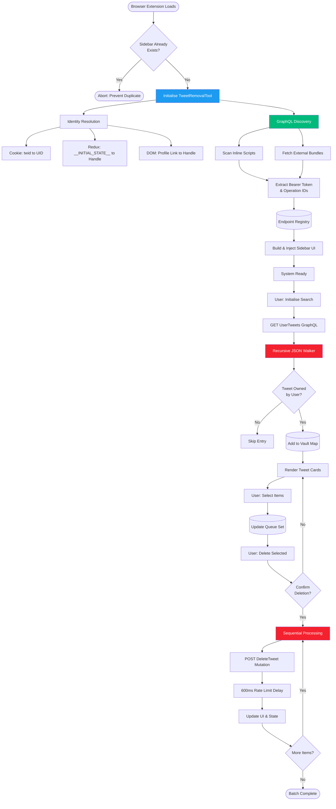

# 🐦 Tweet Removal Tool

<p align="center">
  <strong>Delete your tweets for free, privately, locally, and on your terms.</strong>
</p>

A modern, **local-first Chrome extension** for reviewing and selectively deleting tweets from your X (formerly Twitter) account. There are **no external servers, no subscriptions, and no data collection**. Every action runs directly inside your browser.

> **Disclaimer:** This project is not affiliated with, endorsed by, or supported by Twitter/X. It operates locally within your browser and mirrors official web requests to assist with manual tweet management.

[](LICENSE)
[](https://github.com/iteratequickly/Tweet-Removal-Tool/releases)
[](https://github.com/iteratequickly/Tweet-Removal-Tool/releases)
[](https://www.google.com/chrome/)
[](https://www.google.com/chrome/)

<p align="center">
  
</p>

---

## ✨ Why This Tool Exists

Most tweet deletion services are either **paid**, **server-based**, or **all-or-nothing**. This tool is built for people who want full control, transparency, and privacy.

**What makes it different:**

- 💰 **100% free:** No limits, tiers, subscriptions, or pay-to-delete restrictions.  
- 🔒 **Privacy first:** Operates entirely within your browser. Login tokens, tweets, and cookies never leave your computer.  
- 🔑 **No credentials required:** Uses your existing logged-in X session. You never enter your password into the extension.  
- 🔍 **Selective deletion:** Review tweets in a visual grid and choose exactly what to delete instead of removing everything blindly.  
- ⚡ **No API keys:** Works immediately by mirroring official web requests. No developer account or API access is required.
- 🎯 **User-controlled:** Review each tweet individually before deletion, unlike blind bulk deletion tools.

---

## 🚀 Getting Started

### Installation

1. **Download the latest release:**
   - Visit the [Release Page](https://github.com/iteratequickly/Tweet-Removal-Tool/releases/tag/v1.0)
   - Download the `Tweet-Removal-Tool-v1.0.zip` file
   - Extract the ZIP file to a permanent location (do not delete this folder!)

2. **Load into Chrome:**
   - Open Chrome and navigate to `chrome://extensions/`
   - Enable **Developer mode** (toggle in top right corner)
   - Click **Load unpacked**
   - Select the extracted folder containing `manifest.json`

### How to Use

1. Log in to your account at [https://x.com](https://x.com).  
2. Click the extension icon to launch the sidebar.  
3. Click **Initialise Search** to fetch your recent activity.  
4. Review your tweets, select the items you wish to delete, and confirm.  

---

## 🔐 Privacy & Security

### What data does this tool collect?
**None.** The tool operates entirely within your browser with:
- No external server communication
- No data logging or analytics
- No credential storage
- No persistent data (all cleared when sidebar closes)

### How does authentication work?
The tool reuses your existing X.com browser session. It reads:
- The `twid` cookie for your User ID
- The `ct0` cookie for CSRF tokens
- The Bearer token from the loaded JavaScript on X.com

These tokens are never transmitted outside your browser or stored persistently.

### Can I audit the code?
Yes! This is open-source software. Review the complete source code in this repository before installing.

---

## 🌍 Browser Compatibility

| Browser          | Supported | Notes                               |
|------------------|-----------|-------------------------------------|
| Google Chrome    | ✅ Yes     | Version 88 and above                |
| Microsoft Edge   | ✅ Yes     | Chromium-based versions             |
| Brave            | ✅ Yes     | Shields may need to allow X scripts |
| Opera / Vivaldi  | ✅ Yes     | Chromium-based versions             |
| Mobile Browsers  | ❌ No      | Extensions are not supported        |

---

## ❓ Frequently Asked Questions

<details>
<summary><strong>Why can I only see 40 tweets at a time?</strong></summary>

<br>

The tool fetches tweets using the same GraphQL API that X.com uses, which returns paginated results. Click "Load More" to fetch additional batches. Note that the X API has limitations on how far back you can retrieve tweets in a single session.

</details>

<details>
<summary><strong>Will this tool get my account suspended?</strong></summary>

<br>

The tool mimics normal user interactions and includes rate limiting (600ms between deletions). However, bulk deletions may still trigger automatic detection systems on X. Use responsibly and within the Terms of Service of X.

</details>

<details>
<summary><strong>Can I recover deleted tweets?</strong></summary>

<br>

No. Once tweets are deleted through this tool, they cannot be recovered. Always review your selections carefully before confirming deletion.

</details>

<details>
<summary><strong>Why is my handle not being detected?</strong></summary>

<br>

The tool uses multiple fallback methods to detect your handle. If it shows "Unknown", the tool will still function using your User ID. Ensure you are logged into X.com before launching the extension.

</details>

<details>
<summary><strong>Does this work with protected or private accounts?</strong></summary>

<br>

Yes, the tool works with any account type as long as you are logged in. It only accesses tweets that belong to your authenticated session.

</details>

---

### ⚠️ Limitations & Constraints

- **Session-dependent:** Requires active X.com authentication
- **API pagination:** Cannot access tweets beyond GraphQL response limits
- **Rate limits:** 600ms delay may not prevent all rate-limit errors
- **GraphQL volatility:** X.com may change query structures
- **No undo:** Deleted tweets cannot be recovered through the tool

---

## 🛠️ Technical Background (For Developers)



### Architecture Deep Dive

<details>
<summary><strong>1. Isolation & Injection Strategy</strong></summary>

<br>

The tool runs inside an **IIFE (Immediately Invoked Function Expression)** to prevent variable pollution and avoid conflicts with the code on X.com.
```javascript
(function() {
    // Prevent multiple instances of the sidebar from being added
    if (document.getElementById('trt-sidebar')) return;
})();
```

</details>

<details>
<summary><strong>2. Identity Resolution Pipeline</strong></summary>

<br>

Three-tier fallback system from the `resolveIdentity()` method:
```javascript
resolveIdentity() {
    let uid = document.cookie.match(/twid=u%3D(\d+)/)?.[1];
    let handle = "Unknown";
    try {
        // Check X's internal state object first
        if (window.__INITIAL_STATE__?.session?.user_id === uid) {
            const entities = window.__INITIAL_STATE__.entities?.users?.entities;
            if (entities && entities[uid]) {
                handle = entities[uid].screen_name;
            }
        }
        // Fallback: Scrape from the UI sidebar profile link
        if (handle === "Unknown") {
            const profileLink = document.querySelector('a[data-testid="AppTabBar_Profile_Link"]');
            if (profileLink) {
                handle = profileLink.getAttribute('href').replace('/', '');
            }
        }
    } catch (e) { console.warn("TRT Identity Resolve Error:", e); }
    return { uid, handle };
}
```

</details>

<details>
<summary><strong>3. Dynamic GraphQL Endpoint Discovery</strong></summary>

<br>

The `GraphQLEndpointResolution` class extracts endpoints from the JavaScript on X.com:
```javascript
class GraphQLEndpointResolution {
    constructor() {
        this.registry = new Map();
        this.bearer = null;
        this.patterns = {
            // Regex to find the hardcoded Bearer token in X's source code
            bearer: /"Bearer\s([a-zA-Z0-9%._-]+)"/,
            // Regex to find GraphQL operation definitions (ID + Name)
            operation: /queryId:"([a-zA-Z0-9_-]+)",operationName:"([a-zA-Z0-9_-]+)"/g
        };
    }

    async discover() {
        const scripts = Array.from(document.querySelectorAll('script'));
        const external = scripts.filter(s => s.src).map(s => s.src);
        const inline = scripts.filter(s => !s.src).map(s => s.textContent);

        // Scan inline scripts first (faster)
        inline.forEach(text => this.scanText(text));

        // Prioritise the 'main' bundle where endpoints are usually defined
        const sortedExternal = external.sort((a, b) => a.includes('main.') ? -1 : 0);

        for (const url of sortedExternal) {
            // Exit early if we found our key endpoints and token
            if (this.registry.has('DeleteTweet') && this.registry.has('UserTweets') && this.bearer) break;
            try {
                const response = await fetch(url);
                const text = await response.text();
                this.scanText(text);
            } catch (e) { /* Silent fail for cross-origin or network issues */ }
        }
        return { bearer: this.bearer, endpoints: Object.fromEntries(this.registry) };
    }
}
```

The `scanText` method extracts tokens and operations:
```javascript
scanText(text) {
    if (!this.bearer) {
        const bMatch = text.match(this.patterns.bearer);
        if (bMatch) this.bearer = `Bearer ${bMatch[1]}`;
    }
    let match;
    this.patterns.operation.lastIndex = 0; // Reset regex state
    while ((match = this.patterns.operation.exec(text)) !== null) {
        this.registry.set(match[2], {
            queryId: match[1],
            endpoint: `/i/api/graphql/${match[1]}/${match[2]}`
        });
    }
}
```

</details>

<details>
<summary><strong>4. Recursive JSON Traversal</strong></summary>

<br>

The `parseResponse` method uses a recursive, schema-agnostic walker to navigate X's volatile GraphQL structures:
```javascript
parseResponse(obj) {
    const walker = (o) => {
        if (!o || typeof o !== 'object') return;

        // Identification logic for a tweet entry
        if (o.entryId && o.content?.itemContent?.tweet_results?.result) {
            const result = o.content.itemContent.tweet_results.result;
            // Handle 'legacy' nested structure or direct result
            const tweetData = result.legacy || result;
            const userId = tweetData.user_id_str || result.core?.user_results?.result?.rest_id;
            const tweetId = result.rest_id || result.id_str;

            // Verify ownership: only add if the tweet belongs to the authenticated user
            if (tweetId && tweetData.full_text && userId === this.auth.uid) {
                this.state.vault.set(tweetId, {
                    id: tweetId,
                    text: tweetData.full_text,
                    date: tweetData.created_at,
                    timestamp: tweetData.created_at ? new Date(tweetData.created_at).getTime() : 0
                });
            }
            return;
        }

        // Recurse into all keys
        Object.keys(o).forEach(k => walker(o[k]));
    };
    
    walker(obj);
    this.renderList();
}
```

</details>

<details>
<summary><strong>5. State Management Architecture</strong></summary>

<br>

From the `TweetRemovalTool` constructor:
```javascript
// Application state
this.state = { 
    vault: new Map(),     // Retrieved tweets (ID to Data)
    queue: new Set(),     // IDs selected for deletion
    deleted: new Set(),   // IDs successfully deleted
    isFetching: false     // Guard against concurrent fetch calls
};
```

</details>

<details>
<summary><strong>6. Rate-Limited Deletion Engine</strong></summary>

<br>

The `executeDeletion` method processes deletions sequentially:
```javascript
async executeDeletion() {
    const target = this.auth.endpoints['DeleteTweet'];
    if (!target) return this.log("<span class='trt-error-text'>Delete Endpoint Missing</span>");
    
    // Final user confirmation
    if (!confirm(`Confirm: Delete ${this.state.queue.size} posts permanently?`)) return;
    
    for (let id of Array.from(this.state.queue)) {
        this.log(`Executing deletion: ${id}...`);
        try {
            const r = await fetch(`https://x.com${target.endpoint}`, {
                method: 'POST',
                headers: { 
                    "authorization": this.auth.bearer, 
                    "x-csrf-token": this.auth.csrf, 
                    "content-type": "application/json" 
                },
                body: JSON.stringify({ 
                    variables: { tweet_id: id, dark_request: false }, 
                    queryId: target.queryId 
                })
            });
            
            if (r.ok) {
                this.state.deleted.add(id);
                this.state.vault.delete(id);
                this.state.queue.delete(id);
                // Remove the card from UI immediately
                document.getElementById(`card-${id}`)?.remove();
                this.updateCounters();
            }
        } catch (e) {
            console.error("Deletion Error:", e);
        }
        // Rate-limiting safety: 600ms delay between operations
        await new Promise(res => setTimeout(res, 600));
    }
    this.log("Batch Complete");
}
```

</details>

<details>
<summary><strong>7. Authentication Context Reuse</strong></summary>

<br>

From the constructor, authentication state is built from the session:
```javascript
// Authentication state extracted from current session
this.auth = {
    bearer: null,
    // Reuse CSRF token from cookies (required for POST requests)
    csrf: document.cookie.match(/ct0=([^;]+)/)?.[1],
    uid: identity.uid,
    handle: identity.handle,
    endpoints: {}
};
```

</details>

---

## ⚖️ Licence and Terms

### Terms of Service
Bulk or repetitive actions may conflict with platform Terms of Service regarding automation. Users are solely responsible for compliance with applicable terms and rate limits.  

### Disclaimer
This software is provided "as-is", without warranty of any kind. The authors are not responsible for account restrictions, suspensions, or data loss resulting from the use of this tool.  

### Licence
This project is licensed under the **MIT Licence**. See the [LICENCE](LICENCE) file for details.

---

## 🙏 Acknowledgements

Inspired by the research and tools developed by:

- [DeleteTweets by Lyfhael](https://github.com/Lyfhael/DeleteTweets)  
- [tweetXer by lucahammer](https://github.com/lucahammer/tweetXer)
